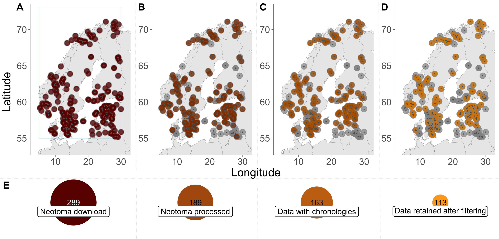

# FOSSILPOL: Scandinavia example

⚠️ **This branch is used as an example of NOT finished workflow for demonstration purposes only.** ⚠️

Please switch to the [`main` branch](https://github.com/HOPE-UIB-BIO/FOSSILPOL-example-Scandinavia/tree/main) to see the final version of the workflow.

-----

This repo is a part of the **FOSSILPOL** project. Learn more about the project on the [project websites](https://hope-uib-bio.github.io/FOSSILPOL-website/)

This repo contains the source code for example run of FOSSILPOL workflow focusing on fossil pollen data from Scandinavia.

We used Neotoma as input data and the selected area of interest is part of the [European Pollen Database](http://www.europeanpollendatabase.net/) as a constituent database of Neotoma. Our goal was to assess the availability of records fulfilling certain quality criteria (spatial extent, pollen sums, levels, and chronology), within the last 8500 cal yr BP. The latter was set as the period of interest in the regional age `limits file`, where `young_age` = `1000`; `old_age` = `5000`, `end_of_interest_period` = `8500`. We also added to the workflow a global biome shapefile (Olsen et al., 2001) and assigned these ecological units of interest to the records. Following the sequential steps in FOSSILPOL, we obtained 289 datasets in the initial download. However, the subsequent steps filtered out substantial numbers of records.

Once the data compilation was finalised (in this case after 4 hours, most of the time being re-estimation of age-depth models). FOSSILPOL provided an overview of the spatial and temporal distribution of records can now be checked visually before proceeding to further analysis.

